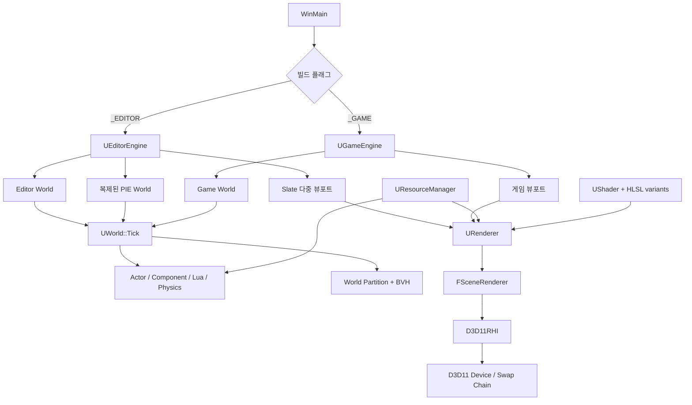
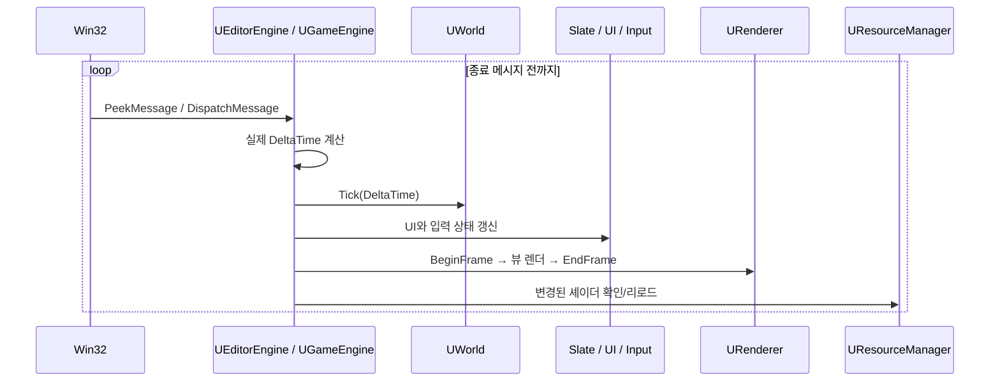
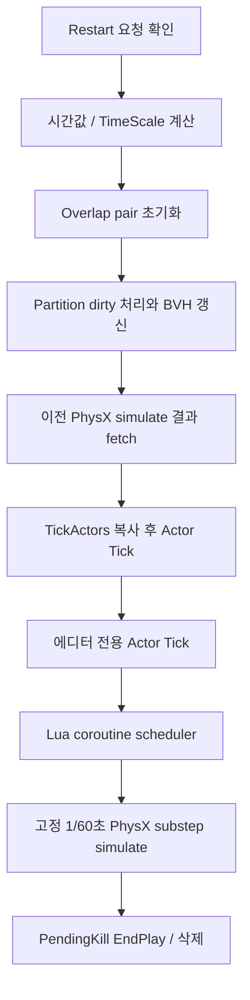
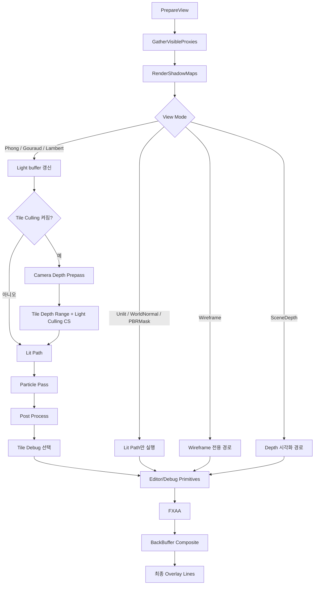
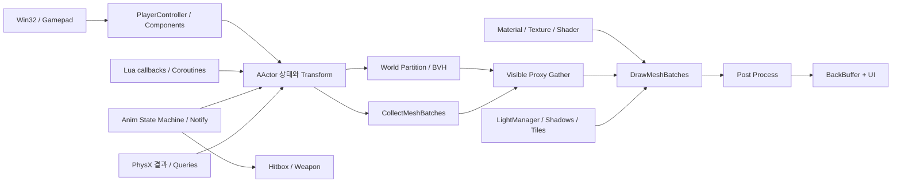

# GameTechLabEngine 구현 명세서

> 기준: 2026-08-12의 로컬 작업 트리 (`main`, 기준 커밋 `f5f7a1b`)  
> 목적: 현재 코드가 **실제로 어떤 순서와 책임 분담으로 실행되는지**를 설명한다. 이상적인 엔진 설계나 향후 계획이 아니라 현재 구현을 기준으로 한다.

## 1. 문서 범위

이 문서는 다음 영역을 다룬다.

- 프로그램 진입과 종료
- 에디터 빌드와 독립 실행 게임 빌드의 차이
- 메인 루프와 프레임 처리 순서
- `UObject` 리플렉션, 월드, 레벨, 액터, 컴포넌트의 소유 관계와 생명주기
- 게임 로직, 입력, Lua, 물리, 애니메이션, 파티클, 오디오 처리
- 씬 수집부터 D3D11 출력까지의 렌더링 파이프라인
- PBR/Blinn-Phong 선택 조건과 현재 PBR의 범위
- 리소스 로딩, 머티리얼, 셰이더 변형 및 핫 리로드
- 에디터 PIE(Play In Editor), 뷰포트, 선택과 직렬화
- 동기/비동기 경계와 현재 구조의 제약

문서에서 `Editor World`는 편집 중인 원본 월드, `PIE World`는 플레이를 위해 복제된 월드, `Game World`는 독립 실행 빌드의 월드를 뜻한다.

---

## 2. 한눈에 보는 구조

GameTechLabEngine은 Windows 전용 C++20 애플리케이션이며, 렌더링은 Direct3D 11, 물리는 PhysX, 스크립팅은 Lua/sol2, 에디터 UI는 ImGui 기반으로 구현되어 있다. Unreal Engine과 비슷한 `UObject → AActor → UActorComponent` 형태와 매크로 기반 리플렉션을 자체 구현했지만, 프레임 오케스트레이션과 렌더링은 대부분 한 메인 스레드에서 직접 수행한다.



핵심 특성은 다음과 같다.

1. 하나의 `WinMain`이 컴파일 플래그에 따라 `UEditorEngine` 또는 `UGameEngine`을 선택한다.
2. 엔진 루프가 메시지 처리, `Tick`, `Render`, 셰이더 핫 리로드를 순차 실행한다.
3. `UWorld`가 액터 로직, Lua 코루틴, 고정 시간 물리, 지연 삭제를 조정한다.
4. 렌더링할 때마다 뷰별로 임시 `FSceneRenderer`를 만들고, 가시 객체를 수집한 뒤 필요한 패스를 실행한다.
5. 주 조명 경로는 Forward이며, 선택적으로 깊이 프리패스와 타일 기반 라이트 컬링을 붙인 Forward+ 형태를 지원한다.
6. 현재 PBR은 ORM 텍스처가 있는 머티리얼에 적용되는 **직접광 Cook-Torrance BRDF**이다. IBL이나 라이트 프로브 기반 간접광 PBR은 구현되어 있지 않다.

---

## 3. 프로젝트와 빌드 구성

### 3.1 주요 디렉터리

| 경로 | 책임 |
|---|---|
| `Mundi/main.cpp` | Win32 진입점, 전역 엔진 선택, 시작/루프/종료 호출 |
| `Mundi/Source/Runtime/Core` | 기본 타입, 수학, 메모리, 객체/리플렉션, 액터 계층 |
| `Mundi/Source/Runtime/Engine` | 월드, 레벨, 컴포넌트, 물리, 애니메이션, 파티클, Lua, 오디오 |
| `Mundi/Source/Runtime/Renderer` | 씬 뷰, 패스 구성, 라이트/그림자, 컬링, 머티리얼 제출 |
| `Mundi/Source/Runtime/RHI` | D3D11 장치, 스왑 체인, 렌더 타깃, 버퍼와 GPU 상태 |
| `Mundi/Source/Runtime/AssetManagement` | 텍스처/메시 로딩과 리소스 캐시 |
| `Mundi/Source/Runtime/Game` | 플레이어, 적, 전투 등 실제 게임 로직 |
| `Mundi/Source/Editor` | 선택, 기즈모, FBX, 그래프 편집/컴파일 |
| `Mundi/Source/Slate` | ImGui 기반 에디터 창, 뷰포트, 게임/통계 오버레이 |
| `Mundi/Shaders` | Shader Model 5 HLSL |
| `Mundi/Data` | 씬, 프리팹, 메시, 텍스처, 애니메이션, 사운드 등 실행 데이터 |
| `Mundi/Generated` | 코드 생성기가 만든 리플렉션/Lua 바인딩 코드 |
| `Mundi/Tools/CodeGenerator` | 헤더 파싱과 Generated 코드/프로젝트 갱신 도구 |

### 3.2 Visual Studio 구성

`Mundi.vcxproj`는 x64 애플리케이션 네 구성을 제공한다.

| 구성 | 핵심 전처리기 | 실행 형태 |
|---|---|---|
| `Debug` | `_DEBUG`, `_CONSOLE`, `_EDITOR` | 디버그 에디터 |
| `Release` | `NDEBUG`, `_CONSOLE`, `_EDITOR` | 릴리스 에디터 |
| `Debug_StandAlone` | `_DEBUG`, `_CONSOLE`, `_GAME` | 디버그 독립 실행 게임 |
| `Release_StandAlone` | `NDEBUG`, `_CONSOLE`, `_GAME` | 릴리스 독립 실행 게임 |

주요 외부 의존성은 다음과 같다.

- Direct3D 11 / D3DCompiler
- DirectXTK, DirectXTex
- ImGui, imgui-node-editor
- PhysX 정적 라이브러리
- Lua와 sol2
- FBX SDK
- XAudio2 / X3DAudio

빌드 전에는 `Tools/CodeGenerator/RunCodeGen.bat`가 `Source/Runtime`을 파싱해 `Generated` 코드를 갱신한다. 빌드 후에는 실행에 필요한 `Data`, `Shaders`, 설정 파일을 출력 디렉터리로 복사한다. 따라서 리플렉션 선언을 바꿨다면 Generated 파일이 갱신되어야 정상 빌드된다.

---

## 4. 프로그램 시작과 종료

### 4.1 진입점

`main.cpp`의 `WinMain`은 다음 순서로 실행된다.

1. 디버그 빌드라면 CRT 메모리 누수 검사를 활성화한다.
2. `FCrashHandler::Init()`으로 예외/덤프 처리를 초기화한다.
3. 전역 `GEngine.Startup(hInstance)`를 호출한다.
4. 시작에 성공하면 `GEngine.MainLoop()`를 실행한다.
5. 루프가 끝나면 `GEngine.Shutdown()`을 호출한다.

`GEngine`의 실제 정적 타입은 빌드 플래그로 결정된다.

- `_EDITOR`: `UEditorEngine`
- `_GAME`: `UGameEngine`

현재 구조는 런타임 설정으로 에디터/게임을 바꾸는 방식이 아니라, 서로 다른 전처리기 구성을 컴파일하는 방식이다.

### 4.2 에디터 시작

`UEditorEngine::Startup`의 주요 순서는 다음과 같다.

1. `editor.ini`를 읽는다.
2. Win32 에디터 창을 만든다.
3. `D3D11RHI`를 초기화하고 `URenderer`를 만든다.
4. 오디오 장치, ImGui UI, 입력 관리자를 초기화한다.
5. 자주 쓰는 OBJ/FBX/오디오/파티클/물리 리소스를 미리 로드한다.
6. Blueprint 액션 데이터베이스를 초기화한다.
7. `EWorldType::Editor`인 `UWorld`를 생성하고 초기화한다.
8. Slate 관리자와 기본 4분할 뷰포트를 만든다.
9. 마지막으로 열었던 레벨을 로드한다.
10. GPU 프로파일러를 초기화한다.

에디터 월드에는 기본적으로 물리 씬을 만들지 않는다. PIE에 진입할 때 별도의 복제 월드와 물리 씬이 생성된다.

### 4.3 독립 실행 게임 시작

`UGameEngine::Startup`은 테두리 없는 전체 화면 Win32 창을 만든 뒤 다음을 수행한다.

1. RHI, 렌더러, 오디오, 입력, UI를 초기화한다.
2. 게임용 `FViewport`를 만든다.
3. 리소스를 미리 로드한다.
4. `EWorldType::Game`인 `UWorld`를 생성한다.
5. 월드를 플레이 상태로 두고 PhysX 씬을 만든다.
6. `Data/Scenes/FINALgameScene.scene`을 로드한다.
7. `GameMode`를 생성하고 `StartPlay()`를 호출한다.

즉, 독립 실행 게임의 시작 씬 경로는 현재 코드에 직접 지정되어 있다.

### 4.4 종료

에디터 종료는 대체로 다음 역순으로 정리된다.

- PIE/Editor 월드 삭제
- UI 및 Slate 종료
- Blueprint 데이터베이스와 오디오 종료
- `ObjectFactory`에 등록된 객체 일괄 삭제
- OBJ 관리 데이터와 렌더러 캐시 해제
- GPU 프로파일러 및 RHI 해제
- 에디터 설정 저장

GPU 객체나 컴포넌트가 참조하는 리소스보다 D3D 장치가 먼저 파괴되지 않도록 종료 순서를 유지해야 한다.

---

## 5. 메인 루프와 한 프레임

### 5.1 공통 루프

두 엔진의 `MainLoop`는 `QueryPerformanceCounter`로 실제 경과 시간을 계산하며, 현재 별도의 고정 렌더 프레임 제한은 없다.



셰이더 리로드는 렌더가 끝난 뒤 처리한다. 렌더 중 사용 중인 셰이더 객체를 교체하는 문제를 피하고, 다음 프레임부터 새 변형을 사용한다.

### 5.2 에디터 프레임

에디터의 논리 갱신 순서는 다음과 같다.

1. UV 스크롤 등 엔진 공통 시간 값 갱신
2. 현재 `GWorld->Tick(DeltaTime)`
3. `USlateManager::Update`
4. `UUIManager::Update`
5. `UInputManager::Update`

렌더 순서는 다음과 같다.

1. `URenderer::BeginFrame`
2. `UUIManager::Render`
3. `USlateManager::Render` — 각 뷰포트가 자신의 `FSceneView`를 렌더
4. `UUIManager::EndFrame`
5. `USlateManager::RenderAfterUI`
6. `URenderer::EndFrame` — Present

`EndPIE` 요청은 즉시 월드를 삭제하지 않고 플래그를 남긴 뒤 다음 메인 루프 경계에서 처리한다. 실행 중인 액터/컴포넌트 순회를 깨지 않기 위한 지연 처리다.

### 5.3 독립 실행 게임 프레임

게임의 논리 갱신 순서는 다음과 같다.

1. 엔진 공통 시간 값 갱신
2. 등록된 게임 월드 `Tick`
3. 게임 UI 갱신
4. 입력 상태 갱신
5. 오디오 장치 갱신 및 끝난 one-shot voice 정리

렌더 시에는 `PlayerCameraManager`가 게임 뷰포트를 기억하고 `FMinimalViewInfo`에서 `FSceneView`를 만든다. 카메라 포스트 프로세스 modifier를 뷰로 복사한 뒤 `RenderSceneForView`를 호출하고, 마지막에 게임 UI와 스왑 체인을 출력한다.

### 5.4 Win32 메시지

전역 `WndProc`는 입력 관리자에게 메시지를 먼저 전달한다. 에디터 빌드에서는 ImGui 메시지 핸들러도 호출한다.

- `WM_SIZE`: 스왑 체인/깊이/씬 렌더 타깃을 다시 만들고 UI 레이아웃을 갱신한다.
- 키/마우스 메시지: 입력 관리자의 현재 상태를 바꾼다.
- `WM_DESTROY`: 메인 루프 종료 메시지를 게시한다.

---

## 6. 객체, 리플렉션, 메모리

### 6.1 객체 계층

```text
UObject
├─ UActorComponent
│  └─ USceneComponent
│     └─ UPrimitiveComponent
│        ├─ UStaticMeshComponent
│        ├─ USkeletalMeshComponent
│        ├─ UParticleSystemComponent
│        └─ Shape / Billboard / Decal / Gizmo ...
└─ AActor
   ├─ APawn / ACharacter
   ├─ AController / APlayerController
   ├─ AGameModeBase / AGameStateBase
   └─ Light / Camera / Mesh Actor ...
```

`UObject` 계열 객체는 일반 `new` 대신 `NewObject<T>()` 또는 `ObjectFactory` 경로로 만드는 것이 기본 규칙이다. 생성된 객체는 전역 `GUObjectArray`에 등록되며, `InternalIndex`는 객체 추적과 GPU 피킹 ID로도 사용된다.

삭제는 `ObjectFactory::DeleteObject`가 배열 슬롯을 비우고 실제 소멸자를 호출한다. 전체 종료에서는 역순 일괄 삭제가 사용된다. 별도의 추적형 가비지 컬렉터가 아니라 명시적 생명주기와 전역 객체 배열을 결합한 구조다.

### 6.2 `UClass`와 코드 생성

`UClass`는 다음 메타데이터를 가진다.

- 클래스 이름과 부모 클래스
- 객체 크기
- 프로퍼티 목록과 오프셋/타입
- 클래스 생성 함수
- 상속 판정과 이름 조회 정보

`UCLASS`, `UPROPERTY`, `UFUNCTION` 매크로를 코드 생성기가 읽어 `.generated.h/.cpp`를 만든다. 생성된 등록 코드는 다음 기능에 사용된다.

- 문자열 클래스 이름으로 객체 생성
- 상속 관계 검사와 `Cast`
- Details 패널 프로퍼티 노출
- JSON 직렬화
- 자동 Lua 바인딩 등록

리플렉션 대상 헤더를 추가하거나 프로퍼티 선언을 바꿀 때는 빌드 전 코드 생성 결과가 프로젝트에 포함되는지 확인해야 한다.

### 6.3 복제

객체 복제는 기본적으로 C++ 복사 생성 후 `DuplicateSubObjects`와 `PostDuplicate`를 수행한다. 얕게 복사하면 위험한 하위 객체나 런타임 핸들은 각 클래스가 `DuplicateSubObjects`에서 다시 만들거나 비워야 한다.

PIE 월드 복제가 대표 사용처다. 예를 들어 skeletal mesh component는 에디터 애니메이션 그래프/인스턴스/PhysX body 포인터를 그대로 공유하지 않고 초기화한 뒤 PIE용 그래프와 런타임 객체를 다시 만든다.

---

## 7. 월드, 레벨, 액터, 컴포넌트

### 7.1 `UWorld`의 책임

`UWorld`는 다음 주요 객체를 소유하거나 관리한다.

- 현재 `ULevel`
- 액터 목록과 tick 대상 목록
- `FLightManager`
- `FLuaManager`
- 게임/PIE에서 사용하는 `FPhysScene`
- `UWorldPartitionManager`와 LBVH
- GPU/CPU 컬링 문맥
- 선택 관리자
- 월드별 `FRenderSettings`
- `GameMode`, `GameState`, `PlayerCameraManager`

전역 `GWorld`는 현재 동작하는 월드를 가리킨다. 에디터에서는 PIE 시작/종료 때 이 포인터가 Editor World와 PIE World 사이에서 전환된다.

### 7.2 월드 초기화와 레벨 교체

월드 생성 시 빈 레벨, 라이트 관리자, Lua 관리자, 선택/컬링 관리자가 준비된다. 일반 월드의 기본 레벨에는 directional light와 ambient light가 추가되며, preview 월드는 더 가벼운 구성을 사용한다.

`SetLevel`은 다음 작업을 수행한다.

1. 렌더 draw cache를 dirty 처리한다.
2. 선택, 카메라, tick 목록을 비운다.
3. 기존 레벨 액터를 정리한다.
4. partition/BVH를 비운다.
5. 새 레벨 액터에 현재 월드를 설정한다.
6. tick 대상 등록과 모든 컴포넌트 등록을 수행한다.
7. 액터 `BeginPlay`를 호출한다.
8. 공간 컴포넌트를 BVH에 일괄 등록한다.
9. `PlayerCameraManager`를 찾고, 없으면 생성한다.

현재 구현에서는 레벨 설치 과정 자체가 액터 `BeginPlay`까지 호출한다. 플레이 여부에 따라 런타임 전용 작업을 구분해야 하는 컴포넌트는 자신의 월드 타입 또는 `bPie`를 확인해야 한다.

### 7.3 액터 생성과 삭제

`SpawnActor`는 다음 경로를 따른다.

1. `UClass`/ObjectFactory로 요청 클래스 생성
2. 초기 transform 설정
3. 레벨 액터 배열에 추가
4. tick 목록 등록
5. 모든 컴포넌트 등록
6. 월드가 플레이 중이면 즉시 `BeginPlay`

`AActor::Destroy()`는 즉시 메모리를 해제하지 않는다. pending kill 상태를 만들고 월드의 삭제 큐에 넣는다. 월드 tick 마지막에 `EndPlay`와 컴포넌트 정리를 거쳐 실제 삭제한다. 이는 액터나 컴포넌트 배열을 순회하는 도중 삭제로 iterator가 무효화되는 것을 막는다.

### 7.4 액터와 컴포넌트 생명주기

```mermaid
stateDiagram-v2
    [*] --> Constructed: ObjectFactory / NewObject
    Constructed --> Registered: RegisterAllComponents
    Registered --> Playing: InitializeComponent + BeginPlay
    Playing --> Ticking: World tick 대상
    Ticking --> PendingKill: AActor::Destroy
    PendingKill --> Ended: EndPlay
    Ended --> Unregistered: Unregister / DestroyComponent
    Unregistered --> [*]: ObjectFactory::DeleteObject
```

`AActor`는 다음을 가진다.

- 하나의 `RootComponent`
- 전체 컴포넌트 집합
- transform 계층에 참여하는 scene component 배열

루트가 없는 액터가 컴포넌트를 등록하면 기본 root scene component가 자동 생성될 수 있다. 새 scene component는 루트 또는 지정 부모에 attach된다. PIE 도중 추가한 컴포넌트는 등록뿐 아니라 초기화와 `BeginPlay`까지 즉시 수행한다.

`UActorComponent`에는 서로 독립적인 상태가 있다.

- 등록 여부 `bRegistered`
- 활성 여부
- tick 가능/활성 여부
- editor tick 허용 여부

등록 생명주기와 플레이 생명주기를 같은 것으로 취급하면 안 된다. `RegisterComponent`는 월드/렌더/물리 시스템에 나타나게 하는 단계이고, `BeginPlay`는 런타임 동작 시작 단계다.

`USceneComponent`는 상대 transform, 부모-자식 관계, 계산된 world matrix를 관리한다. transform 변경은 자식에게 전파되며, 공간 partition에 등록된 primitive는 dirty queue에 들어간다.

`UPrimitiveComponent`는 bounds, collision, visibility, material과 `CollectMeshBatches` 경계를 제공한다. 렌더러가 component를 직접 그리지 않고, component가 `FMeshBatchElement`를 만들어 제출하는 구조다.

### 7.5 `UWorld::Tick`의 정확한 순서



세부 규칙은 다음과 같다.

1. 재시작 요청이 있으면 `ProcessPendingRestart`를 실행하고 일반 tick을 건너뛴다.
2. 실제 delta, time dilation을 적용한 game delta, 액터별 custom dilation 값을 계산한다.
3. 한 프레임 중 같은 충돌 쌍 이벤트가 중복되지 않도록 overlap pair 집합을 초기화한다.
4. transform이 바뀐 공간 컴포넌트를 프레임당 최대 256개 갱신하고 필요하면 BVH를 재구축한다.
5. 이전에 시작한 PhysX simulation 결과를 `WaitForSimulation`으로 회수한다.
6. tick 대상 배열을 복사한 뒤 활성/삭제/tick 플래그를 검사해 액터와 컴포넌트를 갱신한다.
7. PIE가 아닐 때 editor actor는 unscaled delta로 별도 tick한다.
8. PIE 중이면 Lua 코루틴 scheduler를 한 번 갱신한다.
9. 누적 시간을 1/60초 고정 step으로 소비하여 PhysX simulation을 시작한다. 한 프레임 최대 8 substep이며 초과 누적량은 버린다.
10. pending kill 액터에 `EndPlay`를 호출하고 실제 제거한다.

물리는 `fetch previous result → game logic → start next simulation` 구조이므로 게임 로직과 PhysX 결과 사이에 프레임 파이프라이닝이 존재한다.

현재 pause 검사에는 클래스별 예외와 별도 gameplay actor 활성화가 섞여 있다. 특히 월드 tick의 직접 pause 필터는 `ACharacter` 중심이며, `GameState`는 메뉴/일시정지 전환 시 게임플레이 액터들의 tick 활성 상태도 별도로 바꾼다.

---

## 8. 게임플레이 로직

### 8.1 시작 플레이

`AGameModeBase::StartPlay`가 게임 규칙 객체를 구성한다.

1. `GameState` 생성
2. `PlayerController` 생성
3. `Data/Prefabs/Shinobi.prefab`에서 플레이어 pawn/character 생성 시도
4. 실패 시 기본 `ACharacter` 사용
5. Controller가 Pawn을 possess
6. spring arm과 camera component 구성
7. `PlayerCameraManager`의 view target 연결

에디터 PIE는 바로 전투 상태로 진입하는 경로를 사용하고, 독립 실행 게임은 시작 메뉴에서 출발해 게임플레이 액터 tick을 비활성화한다.

### 8.2 게임 상태 흐름

현재 `AGameState`의 큰 상태 흐름은 다음과 같다.

```text
PressAnyKey → MainMenu → BossIntro → Fighting
                                  ├→ Paused → Fighting
                                  ├→ Victory
                                  └→ Defeat
```

플레이어/보스 체력, 스태미나, 포커스, 조준 상태가 게임 UI와 카메라 post-process modifier에 전달된다. 전투 로직은 stats, targeting, hitbox, weapon collision 등의 component로 나뉘고 애니메이션 notify가 공격 판정 활성 구간을 연다.

### 8.3 재시작

재시작은 호출 지점에서 즉시 레벨을 파괴하지 않고 월드에 요청을 남긴다. 다음 `UWorld::Tick`의 첫 단계에서 기존 PhysX 씬과 레벨을 정리하고 시작 씬을 다시 로드한다. 삭제/충돌 callback/렌더 수집 중 재진입하는 것을 피하는 구조다.

---

## 9. 입력 처리

`UInputManager`는 singleton이며 Win32 메시지와 DirectXTK gamepad polling을 결합한다.

### 9.1 키보드와 마우스

`ProcessMessage`가 메시지를 받을 때 현재 키/버튼 상태를 바로 변경한다. 게임/월드/UI 로직은 `IsKeyDown`, `IsKeyPressed`, `IsKeyReleased`로 현재 상태와 이전 상태를 비교한다.

엔진은 `UInputManager::Update`를 논리 tick 끝부분에 호출한다. 이 함수는 다음 프레임 비교를 위해 현재 키/버튼을 previous 배열에 복사하고, 마우스 위치와 화면 크기를 다시 읽으며, wheel delta를 초기화한다. 따라서 edge query는 월드와 UI가 tick하는 동안 소비하고 마지막에 기준 상태를 넘기는 방식이다.

### 9.2 UI 입력 캡처

에디터에서는 ImGui가 마우스나 텍스트 입력을 캡처하면 일반 뷰포트 입력을 억제한다. 다만 skeletal mesh viewer와 particle viewer 안의 렌더 영역은 callback으로 뷰포트임을 알려 카메라 입력을 받을 수 있게 한다. PIE에서는 게임 입력이 우선하도록 별도 경로가 있다.

### 9.3 마우스 잠금과 게임패드

게임 카메라 조작 시 커서를 특정 client 좌표에 고정하고 매 프레임 되돌려 무한 회전 입력을 만든다. ImGui가 마우스를 사용 중이면 잠금을 풀어 UI 조작을 허용한다.

게임패드는 `UInputManager::Update`에서 DirectXTK `GamePad::GetState`로 polling한다. 이 호출 위치상 월드 로직은 직전 update에서 확보된 gamepad 상태를 보게 된다.

---

## 10. 렌더링 아키텍처

### 10.1 주요 타입과 책임

| 타입 | 책임 |
|---|---|
| `FViewport` | 화면 사각형과 입력 전달, `FViewportClient` 호출 |
| `FViewportClient` | 에디터 카메라 조작, `FSceneView` 생성 |
| `FSceneView` | 카메라/투영 행렬, view rect, frustum, show flag, shader macro |
| `URenderer` | 프레임 시작/종료, 공용 캐시, 뷰별 `FSceneRenderer` 생성 |
| `FSceneRenderer` | 한 월드·한 뷰의 가시성 수집과 렌더 패스 실행 |
| `FLightManager` | light 등록, GPU light buffer, shadow resource/데이터 |
| `FTileLightCuller` | 깊이 범위와 타일별 light index compute pass |
| `FGPUOcclusionCuller` | HZB 생성, bounds occlusion compute, 지연 readback |
| `D3D11RHI` | D3D11 device/context/swap chain과 GPU resource 소유 |

에디터 뷰포트는 `SViewportWindow::OnRender → FViewport::Render → FViewportClient::Draw`로 내려가 `FSceneView`를 만들고 renderer를 호출한다. 게임 빌드는 `UGameEngine::Render`가 `PlayerCameraManager`에서 직접 `FSceneView`를 만든다.

### 10.2 좌표계와 뷰

엔진 월드는 Z-up, left-handed 좌표계를 사용하며 front face winding은 clockwise다. 뷰 행렬 구성에서 엔진 축과 DirectX 투영 관례를 맞추기 위한 `YUpToZUp` 변환이 들어간다.

`FSceneView`에는 다음 데이터가 묶인다.

- view/projection 및 역행렬
- 카메라 위치/회전
- view rect와 viewport 크기
- view frustum
- 월드 render settings 복사본/참조
- 카메라 post-process modifier
- view mode에 따른 shader macro

### 10.3 한 뷰의 렌더 순서



`FSceneRenderer`는 뷰 렌더 호출마다 임시로 만들어진다. `URenderer`는 그보다 긴 수명의 static mesh draw cache, 뷰포트별 GPU occlusion context, 동적 line batch를 소유한다.

### 10.4 `PrepareView`

이 단계에서 GPU viewport를 설정하고 뷰 관련 constant buffer를 갱신한다.

| 슬롯 | 대표 내용 |
|---|---|
| `b0` | 모델 행렬 |
| `b1` | view/projection 및 역행렬 |
| `b3` | 색상과 object ID |
| `b4` | 머티리얼 파라미터, `bEnablePBR`, ORM 존재 여부 |
| `b7` | 카메라 위치 |
| `b8` | ambient/directional light |
| `b10` | viewport 정보 |
| `b11` | tile light culling 정보 |
| `b13` | wind 정보 |

### 10.5 가시 객체 수집

`GatherVisibleProxies`는 primitive를 다음 범주로 나눈다.

- 일반 mesh
- billboard
- decal
- text
- particle
- editor line / editor primitive
- gizmo 같은 overlay primitive

수집 과정에는 component 타입, 활성/가시성, editor/game show flag, 레이어 조건이 적용된다.

공간 partition을 사용할 때는 view frustum의 AABB로 BVH를 조회한다. BVH에 들어가지 않는 component는 non-spatial 목록에서 별도 검사한다. partition을 사용하지 않으면 레벨의 전체 액터/컴포넌트를 순회한다.

### 10.6 World Partition과 CPU frustum culling

`UWorldPartitionManager`는 공간에 놓인 편집 가능한 primitive component를 LBVH에 등록한다. transform이나 bounds가 바뀌면 dirty set/queue에 추가하고, 월드 tick에서 프레임당 256개까지 갱신한다. 레벨 로딩 시에는 bulk register 후 BVH를 한 번 구성한다.

이 partition은 액터 단위가 아니라 primitive component 단위다. 한 액터가 여러 mesh/shape component를 가지면 각각 공간 항목이 될 수 있다.

### 10.7 GPU occlusion culling

GPU occlusion은 이전에 렌더한 scene depth로 HZB mip chain을 만들고, compute shader로 candidate bounds의 차폐 여부를 계산한다.

- readback staging buffer 3개를 순환 사용
- `D3D11_MAP_FLAG_DO_NOT_WAIT`로 비차단 확인
- 결과는 최소 1프레임 늦게 적용
- 최대 3프레임까지 최근 결과를 재사용
- 2프레임 연속 occluded여야 실제 제외
- 큰 카메라 이동/회전 시 이전 결과를 버리고 fail-open
- occlusion context는 뷰포트별로 분리

현재 프레임 결과를 기다려 stall시키는 대신 시간적 지연과 보수적 판정으로 popping을 줄이는 설계다.

---

## 11. 라이트, 그림자, Forward+

### 11.1 라이트 관리

light component는 등록 시 `FLightManager`에 자신을 등록하고, 값이 바뀌면 dirty 상태를 만든다. 렌더 시 manager가 ambient/directional constant buffer와 point/spot structured buffer를 갱신한다.

주요 GPU 전달 형태는 다음과 같다.

- Ambient + Directional: constant buffer
- Point lights: structured buffer
- Spot lights: structured buffer
- Shadow maps/data: SRV 및 shadow metadata buffer

### 11.2 그림자

그림자 단계는 가시 primitive 중 cast-shadow mesh batch를 다시 수집한다.

- Directional/Spot: 4096 크기의 2D shadow atlas
- Point: 기본 1024 해상도의 cube array, 최대 8 cube, light당 6 face
- 정적 mesh와 GPU skinned mesh용 `DepthOnly_VS` 변형
- CSM 지원, shader 쪽 최대 cascade 수 8
- shadow anti-aliasing mode에 따라 PCF 또는 VSM

PCF 경로는 depth map을 직접 샘플링하고, VSM 경로는 moment를 저장하는 `R32G32_FLOAT` render target을 사용한다.

### 11.3 Forward+ 타일 라이트 컬링

`SF_TileCulling`이 켜진 lit view에서만 다음이 실행된다.

1. camera depth prepass로 현재 뷰의 깊이를 만든다.
2. `TileDepthRange_CS`가 타일별 최소/최대 깊이를 계산한다.
3. `TileLightCulling_CS`가 타일과 point/spot light의 교차를 검사한다.
4. pixel shader는 해당 타일의 light index만 순회한다.

기본 tile 크기는 16×16 pixel이고 타일당 최대 light index 수는 256이다. 타일 컬링을 끄면 pixel shader가 전체 point/spot light 목록을 순회하는 fallback 경로를 사용한다.

`SF_TileCulling`은 현재 기본 show flag 묶음에는 포함되지 않아 명시적으로 켜야 한다.

---

## 12. 불투명 렌더와 draw submission

### 12.1 Lit path

일반 lit path는 다음 순서다.

1. view rect 범위의 scene color, integer object-ID target, depth를 clear
2. 카메라 중심 sky sphere 렌더
3. opaque mesh/billboard pass
4. 현재 scene depth로 다음 프레임 GPU occlusion 작업 제출
5. decal pass

scene color와 `R32_UINT` object-ID가 MRT로 함께 기록된다. object-ID는 `UObject::InternalIndex`에 대응한다.

### 12.2 Mesh batch 생성

renderer는 `UPrimitiveComponent::CollectMeshBatches`를 호출한다. static/skinned mesh component는 section/material slot별 `FMeshBatchElement`를 만든다.

한 batch에는 대략 다음이 들어 있다.

- vertex/index buffer, stride, topology, draw range
- vertex/pixel shader와 macro variant
- material 또는 MID
- world matrix, 색상, object ID
- CPU/GPU skinning 정보
- particle/instance buffer 정보
- blend/depth/rasterizer 상태에 필요한 분류

component는 장면 의미를 batch로 바꾸고, renderer는 batch를 GPU 명령으로 바꾸는 경계다.

### 12.3 캐시와 정렬

선택적인 static mesh cached path는 월드 revision, 셰이더 revision, view macro key를 기준으로 변하지 않은 static mesh batch를 재사용한다. 120프레임 이상 사용되지 않은 항목은 정리된다. 이 기능의 `SF_StaticMeshCachedPath` 역시 기본 show flag에는 포함되지 않는다.

`SF_MaterialSorting`이 켜져 있으면 batch를 대략 다음 키로 정렬한다.

1. vertex shader
2. pixel shader
3. material
4. vertex/index buffer
5. stride/topology

`DrawMeshBatches`는 직전에 바인딩한 shader, material, buffer, topology 상태를 기억해 같은 상태를 중복 설정하지 않는다.

### 12.4 주요 텍스처 슬롯

`UberLit.hlsl` 기준 주요 pixel shader resource는 다음과 같다.

| 슬롯 | 의미 |
|---|---|
| `t0` | Diffuse/BaseColor |
| `t1` | Normal map |
| `t2` | Forward+ tile light index buffer |
| `t6` | ORM: R=AO, G=Roughness, B=Metallic |
| `t12`, `t13` | GPU skinning matrix/normal matrix |

ORM을 `t6`에 둔 것은 tile light index가 사용하는 `t2`와의 충돌을 피하기 위해서다.

---

## 13. 현재 PBR 구현

### 13.1 적용 조건

현재 PBR 여부는 mesh 종류나 금속이라는 이름만으로 정해지지 않는다. pixel 단위 PBR 경로는 다음 두 조건을 모두 만족해야 한다.

```text
PBR 활성 = World의 SF_PBR가 켜짐 AND 현재 material에 유효한 ORM texture SRV가 있음
```

`SF_PBR`은 기본 show flag에 포함되어 있으므로 기본값은 켜짐이다. 에디터 뷰포트의 PBR 체크박스로 같은 월드의 flag를 전환할 수 있다.

- PBR ON + ORM 있음: 직접광 Cook-Torrance PBR
- PBR OFF: Blinn-Phong fallback
- PBR ON + ORM 없음: Blinn-Phong fallback

따라서 금속 mesh도 **ORM 텍스처가 실제 material에 연결되어 있고 PBR flag가 켜져 있을 때만** metallic PBR로 계산된다. mesh가 어떤 scene에 들어갔는지는 조건이 아니지만, scene/world별 render flag와 material 바인딩 상태는 조건이다.

### 13.2 ORM 채널

ORM 텍스처는 다음 채널 규약을 사용한다.

| 채널 | 값 |
|---|---|
| R | Ambient Occlusion |
| G | Roughness |
| B | Metallic |

### 13.3 BRDF

PBR 직접광은 `LightingCommon.hlsl`의 Cook-Torrance microfacet 모델을 사용한다.

- NDF: GGX
- Geometry: Schlick-GGX/Smith
- Fresnel: Schlick approximation
- Diffuse: Lambert
- 비금속 기본 반사율 `F0`와 metallic에 따른 base color 혼합
- roughness에 따른 specular lobe 변화
- AO는 단순 ambient 항에 적용
- light attenuation과 shadow 결과를 최종 직접광에 적용

Directional, point, spot light가 같은 PBR BRDF를 통해 직접광에 기여한다.

### 13.4 구현 범위

현재 구현은 **직접광 기반 PBR**이다.

포함:

- direct diffuse/specular BRDF
- metallic/roughness/AO texture
- point/spot/directional light
- shadow와 거리/각도 attenuation

미포함:

- environment cubemap 기반 image-based lighting
- irradiance map 기반 indirect diffuse
- prefiltered environment map 기반 indirect specular
- BRDF integration LUT
- reflection probe / light probe
- global illumination

ambient는 환경광 적분 결과가 아니라 단순 ambient color/intensity에 material color와 AO를 곱하는 항이다. 따라서 이 프로젝트에서 “PBR”은 재질의 직접광 반응이 물리 기반이라는 의미이지, 전체 조명이 간접광까지 물리 기반이라는 뜻은 아니다.

### 13.5 PBR 판별 뷰

`PBRMask` view mode는 최종 색 대신 material이 실제 어느 경로를 타는지 표시한다.

- 초록색: `SF_PBR` ON + ORM 존재, PBR active
- 빨간색: PBR이 꺼졌거나 ORM이 없어 Blinn-Phong fallback

일반 화면만 보고 highlight 차이로 추정하는 것보다 이 진단 모드를 사용하는 것이 정확하다.

---

## 14. View mode와 분기

`FSceneView`는 view mode에 따라 shader macro를 구성한다.

| View mode | 핵심 macro/경로 |
|---|---|
| Phong | `LIGHTING_MODEL_PHONG`, PBR 또는 Blinn-Phong 분기 포함 |
| Gouraud | `LIGHTING_MODEL_GOURAUD` |
| Lambert | `LIGHTING_MODEL_LAMBERT` |
| Unlit | lighting macro 없음 |
| WorldNormal | `VIEWMODE_WORLD_NORMAL` |
| PBRMask | `LIGHTING_MODEL_PHONG` + `VIEWMODE_PBR_MASK` |
| Wireframe | 전용 solid-ID + wire 경로 |
| SceneDepth | depth 렌더 후 fullscreen 시각화 |

Phong/Gouraud/Lambert만 full lit branch의 light update, particle, post-process를 거친다. Unlit, WorldNormal, PBRMask는 같은 scene target을 쓰지만 진단용 간소 경로로 `RenderLitPath`만 호출한다. 따라서 PBRMask 결과는 material 경로 판별용이며 최종 게임 화면의 모든 후처리를 재현하는 모드는 아니다.

Wireframe은 object ID를 위한 solid pass 후 depth를 다시 정리하고 wire를 그린다. SceneDepth는 depth-only 렌더 뒤 fullscreen shader로 깊이를 색으로 변환한다.

그림자 필터 macro는 `SHADOW_AA_TECHNIQUE` 값으로 PCF/VSM 변형을 고른다.

---

## 15. 기타 렌더 패스

### 15.1 Sky

sky sphere는 카메라 위치를 중심으로 이동해 멀리 있는 것처럼 보이게 한다. culling을 끄고 depth-always 성격의 상태를 사용하며, 카메라 far plane에 맞게 반지름을 제한한다.

### 15.2 Decal

decal pass는 decal OBB와 주변 target primitive bounds의 교차를 검사해 대상 batch를 만든다. skeletal mesh와 editor primitive는 현재 대상에서 제외된다. translucent blending과 read-only depth를 사용한다. WorldNormal/PBRMask 진단 모드에서는 decal pass를 건너뛴다.

### 15.3 Particle

particle system은 emitter/LOD/module 구조다. module이 spawn, lifetime, location, velocity, rotation, size, color, collision, sub-UV, ribbon, beam 등을 계산한다.

`UParticleSystemComponent`의 기본 `bUseAsyncSimulation`은 true다.

1. 메인 스레드가 delta, component transform, 카메라, 인근 collider proxy를 `FParticleSimulationContext`로 스냅샷한다.
2. `std::async(std::launch::async)` 작업이 emitter simulation, 정렬, 동적 render data 생성을 수행한다.
3. 작업 중이면 delta를 누적하고 이전 render data를 계속 사용한다.
4. 렌더 수집 시 `TrySync`로 완료된 결과만 비차단 교체한다.
5. sprite, mesh, beam, ribbon batch로 변환한다.

불투명, translucent, additive particle을 분류해 그리며 mesh particle은 일반 light buffer를 사용할 수 있다. particle pass에서는 Forward+ tile 목록 대신 전체 light fallback을 사용한다.

### 15.4 Editor primitive와 overlay

grid, icon, bounds, gizmo 같은 편집 도형은 일반 게임 geometry와 분리해 수집한다. editor primitive는 scene 렌더/후처리 뒤에 합성되는 경로를 사용해 식별성을 유지한다. 최종 overlay line은 backbuffer composite 뒤에 그려진다.

### 15.5 Post process

카메라 modifier와 첫 height fog actor를 모아 priority와 weight를 적용한다. 구현된 주요 pass는 다음과 같다.

- Height Fog
- Fade In/Out
- Vignette
- Bloom
- Gamma Correction
- Depth of Field: setup → blur/denoise → recombine
- FXAA

scene color는 두 개의 ping-pong target을 `FSwapGuard`로 교대 사용한다. DOF는 quarter-resolution `R16G16B16A16_FLOAT` target 4개, Bloom은 half-resolution target 2개를 사용한다. 마지막 FXAA와 blit이 backbuffer에 출력된다.

---

## 16. RHI와 GPU 리소스

`RHIDevice` 이름의 계층이 있지만 renderer는 현재 `D3D11RHI`의 구체 기능과 D3D11 context를 직접 사용한다. 다른 그래픽 API로 교체 가능한 완전한 추상화는 아니다.

`D3D11RHI`가 소유하는 주요 항목은 다음과 같다.

- D3D11 device와 immediate context
- DXGI swap chain
- sRGB backbuffer RTV
- scene color ping-pong texture/RTV/SRV
- `R32_UINT` object-ID render target과 staging texture
- `D24_UNORM_S8_UINT` depth DSV와 depth SRV
- DOF/Bloom 중간 target
- rasterizer/depth/blend state와 sampler
- 공용 constant buffer와 fullscreen helper

윈도우 크기가 바뀌면 backbuffer뿐 아니라 scene color, ID, depth, DOF, Bloom 등 크기 종속 리소스를 다시 만든다.

### GPU 피킹

뷰포트 클릭 시 object-ID target의 한 pixel을 staging texture로 복사하고 CPU에서 읽는다. ID로 `GUObjectArray`를 조회해 선택 객체를 찾는다. 현재 readback은 동기 경로이므로 잦은 호출은 GPU/CPU stall을 만들 수 있다.

---

## 17. 리소스, 머티리얼, 셰이더

### 17.1 리소스 관리자

`UResourceManager`는 singleton이며 정규화한 경로와 리소스 타입을 키로 캐시한다.

```text
Load<T>(Path)
  ├─ cache hit  → 기존 UObject 리소스 반환
  └─ cache miss → NewObject<T> → Load → 타입별 map 등록
```

지원 영역에는 texture, static/skeletal mesh, shader, sound, particle system, physics asset 등이 포함된다. OBJ/FBX importer와 DDS/OBJ cache 기능이 있으며 `pch.h`의 `USE_DDS_CACHE`, `USE_OBJ_CACHE`가 활성화되어 있다.

### 17.2 머티리얼

머티리얼 계층은 다음과 같다.

- `UMaterialInterface`: 공통 조회 인터페이스
- `UMaterial`: 원본 material 정보와 texture resolve
- `UMaterialInstanceDynamic`: 런타임 texture/scalar/color/wind override

현재 핵심 texture slot은 diffuse/base color, normal, ORM이다. ORM 경로가 명시되지 않았을 때 material은 diffuse 파일명에서 `BaseColor → ORM`, `_Diffuse → _ORM`, `_BC → _ORM` 등의 후보를 만들어 존재하는 texture를 찾는다.

MID는 원본 material을 기준으로 override한다. MID를 다시 parent MID로 삼는 중첩 구조는 지원하지 않는다.

`FMaterialInfo`의 기존 binary archive 호환을 위해 ORM 파일명은 해당 binary 직렬화 목록에 포함하지 않는다. ORM은 editor/MID 또는 런타임 할당 경로로 유지해야 하므로 asset round-trip 시 주의가 필요하다.

### 17.3 셰이더 컴파일과 변형

`UShader`는 `D3DCompile`로 Shader Model 5 코드를 컴파일한다.

- 이름이 `_VS`, `_PS`, `_CS`로 끝나는 파일: 해당 stage로 컴파일
- 일반 shader 파일: `mainVS`와 `mainPS` entry를 가진 통합 shader로 처리
- view mode, skinning, shadow 방식 등의 macro 조합을 stable hash로 캐시
- include 파일 timestamp까지 추적

리소스 관리자는 약 0.5초 간격으로 변경 여부를 검사한다. 변경이 발견되면 현재 프레임 렌더가 끝난 뒤 shader를 다시 컴파일하고 shader revision을 올려 static mesh cache를 무효화한다.

대표 shader 파일:

- `Shaders/Materials/UberLit.hlsl`
- `Shaders/Common/LightingCommon.hlsl`
- `Shaders/Shadows/DepthOnly_VS.hlsl`
- `Shaders/Lighting/TileDepthRange_CS.hlsl`
- `Shaders/Lighting/TileLightCulling_CS.hlsl`
- `Shaders/Occlusion/*`
- `Shaders/PostProcess/*`

---

## 18. 물리와 충돌

### 18.1 PhysX 초기화

PhysX foundation, physics, PVD, 기본 material, CPU dispatcher, vehicle SDK/friction 데이터는 process-level shared resource로 ref-count 관리된다. 각 Game/PIE world는 자신의 `PxScene`을 가진다.

- 좌표계: Z-up
- 중력: `(0, 0, -9.81)`
- worker 수: CPU core 수를 기준으로 생성한 PhysX dispatcher
- 게임/PIE에만 물리 씬 생성

즉, 엔진의 game/render 오케스트레이션은 한 메인 스레드 중심이지만 PhysX 내부 simulation은 worker dispatcher를 사용한다.

### 18.2 Body와 shape

`FBodySetup`/`UPhysicsAsset`이 shape 정의와 material 정보를 제공하고, `FBodyInstance`가 실제 `PxRigidActor`, owner primitive component, body setup을 연결한다. static mesh와 skeletal mesh component는 `BeginPlay`에서 조건에 맞는 body를 물리 씬에 만든다.

static/dynamic actor, collision enable/query/simulation flag, physical material override를 지원한다. character movement는 sweep query를 사용해 이동과 충돌을 해결한다.

### 18.3 이벤트

PhysX simulation callback은 `PxActor::userData`에서 `FBodyInstance → UPrimitiveComponent → AActor`를 찾는다. trigger/contact 이벤트를 component/actor delegate로 전달한다. 월드의 정규화된 overlap pair set으로 같은 프레임 중복 이벤트를 줄인다.

### 18.4 고정 시간과 프레임 관계

물리 step은 1/60초이며 한 렌더 프레임에서 최대 8회 수행한다. 누적 시간이 지나치게 크면 나머지를 버려 spiral of death를 제한한다.

현재 순서는 “이전 step 결과 회수 → 액터 로직 → 다음 step 시작”이다. 그러므로 physics-driven transform이나 callback을 읽는 시점은 이 파이프라인을 고려해야 한다.

---

## 19. 애니메이션과 스키닝

### 19.1 초기화

`USkeletalMeshComponent::BeginPlay`는 다음을 수행한다.

1. PIE라면 `AnimGraphPath`에서 그래프를 새로 읽어 editor 객체와 분리한다.
2. physics asset override 또는 skeletal mesh 기본 physics asset을 선택한다.
3. `UAnimInstance`와 `UAnimationStateMachine`을 생성한다.
4. `FAnimBlueprintCompiler`가 editor graph를 runtime state machine으로 컴파일한다.
5. 물리 씬과 physics asset이 있으면 bone body/constraint를 만든다.
6. AnimGraph 없이 physics asset만 있으면 ragdoll 성격의 PhysicsDriven 상태로 전환한다.

### 19.2 프레임 갱신

AnimationDriven 상태의 큰 순서는 다음과 같다.

1. state machine transition/update
2. 현재/전환 대상 state pose 평가
3. blend와 montage overlay
4. notify와 curve 갱신
5. root motion 소비 및 owner transform 반영
6. local pose → component-space bone transform
7. 최종 skinning matrix 생성
8. 필요하면 animation pose를 PhysX bone body로 동기화

PhysicsDriven에서는 PhysX body transform에서 skeleton pose를 가져오며, Blending 상태는 ragdoll pose와 animation pose를 보간한다.

### 19.3 CPU/GPU skinning

show flag에 따라 두 경로가 있다.

- GPU skinning: bone skin matrix와 normal matrix를 structured buffer로 업로드하고 `t12`, `t13`에서 읽는다.
- CPU skinning: CPU가 변형한 vertex를 dynamic skinned vertex buffer로 갱신한다.

그림자 pass도 GPU skinning 여부에 맞는 depth-only shader variant를 선택한다.

### 19.4 Notify

애니메이션 notify는 단순 이벤트뿐 아니라 게임플레이 연결점이다. 현재 notify에는 다음 종류가 있다.

- combo window
- hitbox/weapon collision 활성화
- particle on/off 또는 spawn
- sound 재생
- camera 재생/target 변경
- animation pause
- trail state

공격 판정 타이밍이 애니메이션 재생 시간과 직접 연결되므로 montage/state 변경 시 notify 구간도 함께 검증해야 한다.

---

## 20. Lua 스크립팅

각 `UWorld`는 독립적인 `FLuaManager`와 Lua state를 가진다. 기본 Lua library, component/engine function, 공용 library와 생성된 binding registry를 등록한다.

`ULuaScriptComponent::BeginPlay` 흐름은 다음과 같다.

1. owner world의 Lua state를 얻는다.
2. component별 독립 environment를 만든다.
3. owner actor를 감싼 `FGameObject` proxy를 `Obj`로 넣는다.
4. `StartCoroutine`을 노출한다.
5. 지정 Lua 파일을 environment에서 실행한다.
6. `BeginPlay`, `Tick`, `OnOverlap`, `OnHit`, `EndPlay` 함수를 캐시한다.
7. actor/component collision delegate에 script callback을 연결한다.

PIE 중 월드 tick이 actor tick 다음에 coroutine scheduler를 한 번 갱신한다. component 종료 시 해당 owner의 coroutine을 취소해 이미 파괴된 UObject를 다시 접근하지 않게 한다.

Lua 오류는 로그로 전달되며 에디터 플레이에서는 안전을 위해 PIE 종료로 이어질 수 있다.

---

## 21. 오디오

`FAudioDevice`는 정적 XAudio2 장치와 mastering voice를 만들고 실제 출력 channel mask로 X3DAudio를 초기화한다.

지원 흐름:

- WAV PCM 리소스 로드
- 2D one-shot
- 위치 기반 3D sound
- looping source voice
- listener 위치/방향 갱신
- emitter 위치 변화에 따른 X3DAudio matrix 계산
- 끝난 one-shot voice를 `Update`에서 정리

`UAudioComponent`는 `BeginPlay`/`EndPlay`에 source voice를 만들고 정리하며 component transform을 3D emitter 위치에 반영한다. 장치 종료 때 active voice와 one-shot voice를 모두 중지/flush/destroy한 뒤 mastering voice와 XAudio2를 해제한다.

---

## 22. 에디터와 PIE

### 22.1 UI 구조

에디터 UI는 두 층으로 나뉜다.

- `UUIManager`: ImGui frame과 D3D11 backend 관리
- `USlateManager`: 자체 window/widget 계층, viewport/layout/details/content browser 등 관리

기본 layout은 Perspective, Front, Left, Top 4개 뷰와 control/details panel을 splitter로 조합한다. 단일 main viewport layout도 지원한다. main perspective viewport camera가 editor camera 역할을 한다.

뷰포트 toolbar에서 view mode, show flag, layout, 렌더 디버그 옵션을 변경할 수 있다.

### 22.2 선택과 기즈모

선택은 GPU object-ID picking과 `SelectionManager`를 사용한다. 선택된 actor/component transform은 translate/rotate/scale gizmo로 편집한다. transform 변경은 scene hierarchy를 갱신하고 해당 primitive의 partition entry와 렌더 cache를 dirty 처리한다.

### 22.3 PIE 시작

`UEditorEngine::StartPIE`는 다음 순서를 가진다.

1. `UWorld::DuplicateWorldForPIE`로 editor world 복제
2. `GWorld`와 Slate viewport의 world를 PIE world로 변경
3. `bPie` 설정과 PhysX scene 준비
4. GameMode 보장 및 `StartPlay`
5. 게임 커서 잠금/표시 상태 적용
6. 복제 액터들의 `BeginPlay` 실행
7. 복제 중 생긴 pending kill 정리

원본 editor world를 직접 플레이하지 않으므로 게임 중 transform, spawn, destroy가 편집 데이터에 그대로 남지 않는다.

### 22.4 PIE 종료

종료 요청은 지연 플래그로 전달된다. 다음 루프 경계에서 다음을 수행한다.

1. game input context 제거
2. PIE actor `EndPlay` 및 PIE world 삭제
3. `GWorld`를 editor world로 복원
4. Slate viewport world와 카메라/선택 상태 복구
5. 커서 잠금 해제

---

## 23. 씬, 프리팹, 직렬화

### 23.1 레벨 JSON

`ULevel::Serialize`가 JSON scene을 저장하고 읽는다. 주요 구조는 다음과 같다.

```json
{
  "PerspectiveCamera": { "...": "..." },
  "Actors": {
    "actor-uuid": {
      "Type": "AStaticMeshActor",
      "...": "reflected properties"
    }
  }
}
```

로드 시 `Type` 문자열을 `UClass::FindClass`로 찾고 ObjectFactory가 실제 subclass를 만든다. 이후 `UObject::Serialize`가 `FProperty`의 타입과 메모리 오프셋을 사용해 값을 적용한다.

프리팹도 같은 리플렉션/JSON 원리를 사용하지만 단일 actor와 component tree를 저장하고 spawn하는 용도다.

현재 level serialization 일부가 전역 `GWorld`를 참조하므로, 여러 world를 동시에 다룰 때는 직렬화 대상 world와 전역 current world가 일치해야 한다.

### 23.2 리소스 참조

scene/prefab은 대형 mesh/texture 데이터를 직접 넣지 않고 경로를 저장한다. 로드 후 component가 `UResourceManager`를 통해 해당 UObject resource를 resolve하고 캐시를 공유한다.

---

## 24. 스레드와 비동기 경계

사용자 코드 관점에서 프레임을 조정하는 주체는 하나의 메인 스레드다.

```text
Main thread
  Win32 messages
  → World / Actor / Component / Lua tick
  → Scene gather / D3D11 immediate-context rendering
  → UI
  → Present

Background / library-managed work
  ├─ Particle: component별 std::async simulation
  ├─ PhysX: PxDefaultCpuDispatcher worker
  └─ XAudio2: 오디오 엔진 내부 처리
```

명시적으로 분리된 render thread나 job graph는 없다. D3D11 immediate context 제출은 메인 스레드에서 이뤄진다. 다만 particle, PhysX, XAudio2 내부에는 실제 비동기/worker 동작이 있으므로 UObject 수명과 결과 교환 지점을 지켜야 한다.

Particle async 작업에는 live UObject를 자유롭게 넘기지 않고, 메인 스레드가 만든 simulation context와 emitter instance 목록을 사용한다. render는 future 완료를 강제로 기다리지 않고 이전 dynamic data를 유지한다. component 소멸자는 남은 future 완료와 heap render data 정리를 보장한다.

---

## 25. 시스템 간 데이터 흐름



이 흐름에서 component가 여러 시스템의 연결점이다. 예를 들어 skeletal mesh component 하나가 animation state, PhysX bodies, material, mesh batch를 모두 연결한다. component를 복제/삭제할 때 각 하위 시스템 등록과 런타임 자원을 모두 정리해야 하는 이유다.

---

## 26. 현재 구현상의 제약과 주의점

### 26.1 아키텍처 제약

- `GEngine`, `GWorld`와 여러 singleton에 의존하므로 다중 독립 엔진 인스턴스나 완전 병렬 world 처리가 어렵다.
- game thread와 render thread가 분리되어 있지 않아 무거운 scene gather, shader compile, 동기 GPU readback이 프레임 시간에 직접 나타난다.
- renderer가 `D3D11RHI`와 D3D11 타입을 직접 사용해 API 교체 비용이 크다.
- `FSceneRenderer`가 뷰마다 가시성 수집과 shadow pass를 수행하므로 에디터 4분할 뷰에서는 동일 world 작업이 반복될 수 있다.
- object lifetime은 tracing GC가 아니라 명시적 등록/삭제에 의존한다. async 작업과 raw pointer 공유 시 종료 동기화가 필수다.

### 26.2 렌더링 제약

- PBR은 직접광만 지원하고 IBL/GI/reflection probe는 없다.
- ORM texture가 없는 material은 PBR flag가 켜져도 자동으로 metallic/roughness 상수 PBR을 사용하지 않고 Blinn-Phong으로 fallback한다.
- particle mesh lighting은 full light 목록을 사용하며 tile light list를 사용하지 않는다.
- GPU picking은 동기 readback이라 호출 빈도에 따라 stall 가능성이 있다.
- GPU occlusion은 의도적으로 지연 결과를 사용하므로 빠른 카메라 변화에서는 fail-open되며 잠시 더 많은 object가 그려질 수 있다.
- static mesh cached path와 Forward+ tile culling은 구현돼 있지만 기본 flag 묶음에는 포함되지 않는다.

### 26.3 데이터와 로직 제약

- 독립 실행 시작 scene과 player prefab 경로가 코드에 고정되어 있다.
- level serialization의 일부가 `GWorld`에 의존한다.
- `FMaterialInfo` binary archive는 호환성 때문에 ORM 경로를 저장하지 않는다.
- input snapshot을 tick 끝에 갱신하므로 새 시스템은 키보드/마우스 edge와 gamepad poll의 시점을 구분해야 한다.
- level 설치가 `BeginPlay`를 호출하는 구조이므로 editor world에서 실행하면 안 되는 component 코드는 `bPie`/world type guard가 필요하다.
- 애니메이션, 물리, particle의 runtime handle은 PIE 복제 시 공유하면 안 되며 `DuplicateSubObjects`에서 명시적으로 재생성해야 한다.

---

## 27. 기능 추가 시 연결 지점

### 새 Actor/Component 추가

1. `UCLASS`와 필요한 `UPROPERTY`를 선언한다.
2. `IMPLEMENT_CLASS`/generated include 규칙을 따른다.
3. component라면 등록, 초기화, `BeginPlay`, `EndPlay`, 복제 책임을 구분한다.
4. transform/bounds가 있으면 partition dirty와 렌더 cache invalidation을 연결한다.
5. 빌드 전 code generation 결과를 확인한다.

### 새 렌더 패스 추가

1. 입력/output render target과 실행 view mode를 정한다.
2. `FSceneRenderer::Render`의 어느 단계에 들어갈지 결정한다.
3. pass 전후 D3D11 state, SRV/UAV hazard, viewport를 명시적으로 정리한다.
4. scene color ping-pong을 쓴다면 `FSwapGuard` 규칙을 따른다.
5. editor 4-view와 game viewport 양쪽에서 검증한다.

### 새 머티리얼 파라미터 추가

1. `FMaterialInfo`, `UMaterial`, MID override 정책을 정한다.
2. C++ constant buffer와 HLSL cbuffer의 크기/정렬을 동시에 수정한다.
3. `DrawMeshBatches`의 binding과 기본값을 추가한다.
4. JSON/binary 호환 정책을 결정한다.
5. shader hot reload와 macro variant에서도 동작하는지 확인한다.

### 새 게임 상태 추가

1. `AGameState` 전이 조건과 enter/exit 처리를 만든다.
2. gameplay actor tick 활성 상태를 정의한다.
3. input context, cursor, UI, camera modifier 상태를 함께 전환한다.
4. PIE 시작 경로와 standalone 시작 메뉴 경로를 각각 검증한다.

---

## 28. 핵심 코드 위치

| 관심사 | 시작해서 읽을 파일 |
|---|---|
| 프로그램 진입 | `main.cpp` |
| 에디터 엔진 | `Source/Runtime/Engine/GameFramework/EditorEngine.cpp` |
| 게임 엔진 | `Source/Runtime/Engine/GameFramework/GameEngine.cpp` |
| 월드 tick/PIE 복제 | `Source/Runtime/Engine/GameFramework/World.cpp` |
| 레벨 JSON | `Source/Runtime/Engine/GameFramework/Level.cpp` |
| 액터/컴포넌트 | `Source/Runtime/Core/Object/Actor.cpp`, `ActorComponent.cpp` |
| 리플렉션/팩토리 | `Source/Runtime/Core/Object/Object.h`, `Object.cpp`, `ObjectFactory.*`, `Property.h` |
| 뷰 구성 | `Source/Runtime/Renderer/SceneView.cpp`, `FViewportClient.cpp` |
| 전체 렌더 패스 | `Source/Runtime/Renderer/SceneRenderer.cpp` |
| 프레임/RHI 연결 | `Source/Runtime/Renderer/Renderer.cpp` |
| D3D11 리소스 | `Source/Runtime/RHI/D3D11RHI.cpp` |
| PBR shader | `Shaders/Materials/UberLit.hlsl`, `Shaders/Common/LightingCommon.hlsl` |
| 라이트/그림자 | `Source/Runtime/Renderer/LightManager.cpp` |
| Forward+ | `Source/Runtime/Renderer/TileLightCuller.cpp` |
| GPU occlusion | `Source/Runtime/Renderer/GPUOcclusionCuller.cpp` |
| 머티리얼 | `Source/Runtime/Renderer/Material.cpp` |
| 리소스 | `Source/Runtime/AssetManagement/ResourceManager.cpp` |
| 물리 | `Source/Runtime/Engine/Physics/PhysScene.cpp`, `BodyInstance.cpp` |
| 애니메이션 | `Source/Runtime/Engine/Animation/AnimInstance.cpp`, `Components/SkeletalMeshComponent.cpp` |
| 파티클 | `Source/Runtime/Engine/Components/ParticleSystemComponent.cpp`, `Engine/Particle/Async/ParticleAsyncUpdater.cpp` |
| Lua | `Source/Runtime/Engine/Scripting/LuaManager.cpp`, `Components/LuaScriptComponent.cpp` |
| 입력 | `Source/Runtime/InputCore/InputManager.cpp` |
| 오디오 | `Source/Runtime/Engine/GameFramework/FAudioDevice.cpp`, `Components/AudioComponent.cpp` |
| 에디터 UI/뷰포트 | `Source/Slate/USlateManager.cpp`, `Windows/SViewportWindow.cpp` |
| 게임 규칙 | `Source/Runtime/Engine/GameFramework/GameModeBase.cpp`, `GameState.cpp` |

---

## 29. 요약

이 프로젝트는 자체 `UObject`/리플렉션/월드 계층 위에 게임 로직과 에디터를 함께 올리고, 뷰마다 scene proxy를 수집해 D3D11 Forward 렌더링을 수행하는 구조다. CPU frustum/BVH와 이전 프레임 HZB occlusion, 선택적 Forward+ 타일 컬링, 그림자, 파티클, post-process를 하나의 `FSceneRenderer`가 조정한다.

게임 로직은 `UWorld::Tick`이 actor/component, Lua coroutine, 고정 시간 PhysX, 지연 삭제를 정해진 순서로 연결한다. 에디터는 원본 world를 복제한 PIE world에서 같은 게임 실행 경로를 사용한다.

현재 PBR은 `SF_PBR`과 ORM texture 존재 여부로 선택되는 직접광 Cook-Torrance 경로이며, 조건을 만족하지 않으면 Blinn-Phong으로 fallback한다. PBRMask view mode가 실제 적용 여부를 초록/빨강으로 명확하게 보여준다.
